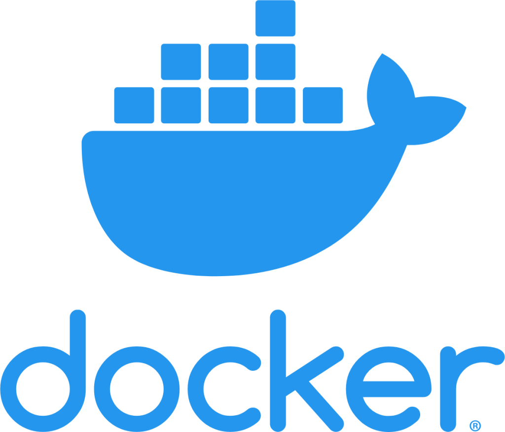
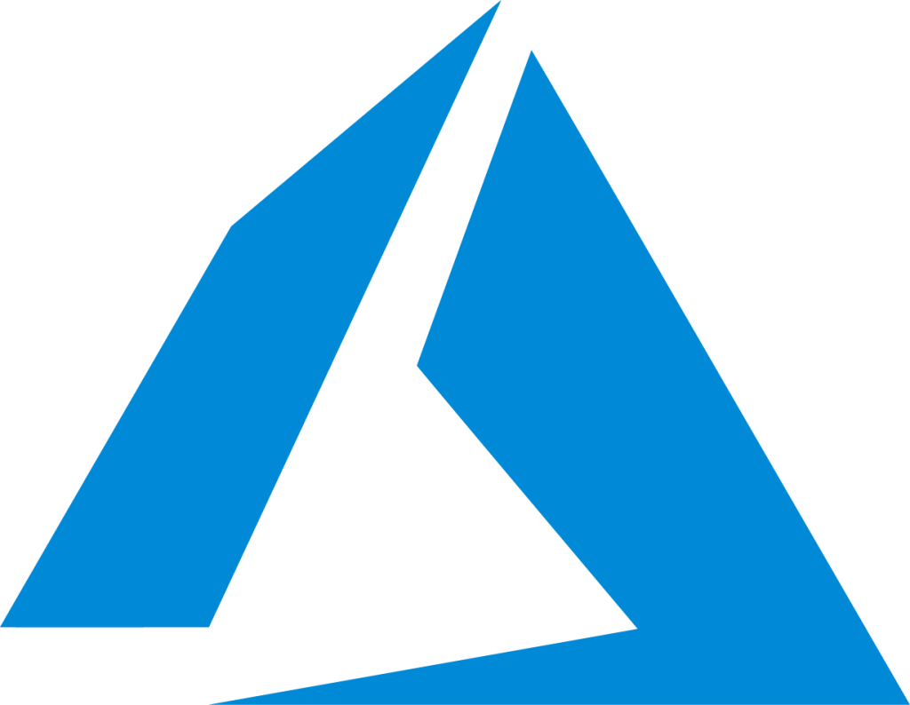

<!--
**rajeev033/rajeev033** is a ✨ _special_ ✨ repository because its `README.md` (this file) appears on your GitHub profile. -->
<h2 align='center'> Hey  , I am Rajeev Sharma</h2> 

Tech enthusiast and full-stack web developer, currently exploring the world of DevOps. Pursuing a B.Tech degree in Computer Science and Engineering. Passionate about building robust and scalable web applications.

- 🔭 I’m currently refining backend sills with **Node.js** and **Express.js** 
- 🌱 I’m currently learning **DevOps**
- 👯 Open to collaborate on **MERN** Stack Projects
- 🤔 Seeking Assistance with **CI/CD Pipelines**, **Docker** and **Kubernetes**
- 💬 Ask me about **React.js**, **Express.js** **Node.js**
- 📫 How to reach me: **[Email](rajeev.s.2403@gmail.com)**, **[X (Twitter)](https://twitter.com/rajeev_s24)**
 <!--😄 Pronouns: ...
 ⚡ Fun fact: ...-->

<h3 align="left">Languages and Tools:</h3>

|||||
|---|---|---|---|---|---|

|||||
|---|---|---|---|---|---|

|||||
|---|---|---|---|---|---|

